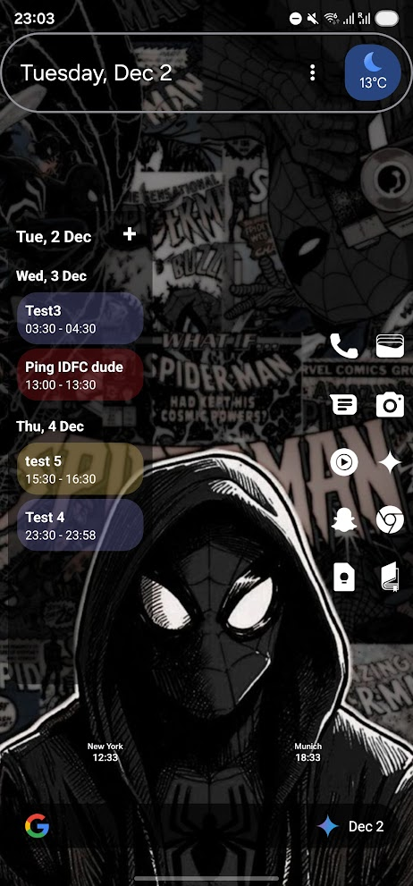

# Transparent Calendar Widget
## (mostly) Created by Google Antigravity

A modern, transparent, and highly efficient Android Home Screen widget that displays your Google Calendar events. Designed to be minimal, beautiful, and battery-friendly.

## 🌟 Key Features

*   **Transparent Design**: Blends seamlessly with your wallpaper.
*   **Smart Grouping**: Events are logically grouped by date headers.
*   **Multi-Day Support**: Long events appear correctly under every day they span.
*   **Auto-Refresh**: Automatically updates when you add/edit events or change timezones.
*   **Full Screen Notifications**: Get a timely, black-themed full screen reminder for your events with a dismiss button.
*   **Battery Efficient**: Uses Android's `JobScheduler` and `AlarmManager` to wake up *only* when necessary.
*   **Interactive**: Click events to open them in your Calendar app.

## 🏗️ Architecture & Components

This project follows standard Android Widget architecture but adds a modern twist for efficiency. Here's how the pieces fit together:

### 1. `CalendarWidgetProvider.kt`
*   **Role**: The "Brain" of the widget.
*   **Function**: It receives system broadcasts (like `APPWIDGET_UPDATE`, `TIMEZONE_CHANGED`) and orchestrates updates.
*   **Key Logic**: It sets up the `RemoteViews` (the layout), binds the list adapter, and handles the "+" button click. It acts as the bridge between the Android system and our widget's UI.

### 2. `CalendarWidgetService.kt`
*   **Role**: The "Connector".
*   **Function**: It's a `RemoteViewsService` that simply returns our `CalendarWidgetFactory`. It allows the widget's `ListView` to talk to our data source.

### 3. `CalendarWidgetFactory.kt`
*   **Role**: The "Data Factory".
*   **Function**: This is where the heavy lifting happens.
    *   **Fetching**: It queries the Android `CalendarContract` ContentProvider to get your events.
    *   **Processing**: It sorts events, handles multi-day logic (splitting one event across multiple days), and inserts Date Headers.
    *   **Rendering**: It creates the individual list items (Event rows and Date Headers) you see in the widget.

### 4. `CalendarUpdateJobService.kt`
*   **Role**: The "Watchdog".
*   **Function**: Instead of running a background service 24/7 (which kills battery), we use a `JobService`.
*   **Efficiency**: It registers a `TriggerContentUri` on the Calendar database. The system *only* wakes this job up when the Calendar data actually changes. It then tells the widget to refresh and updates the notification schedule.

### 5. `NotificationScheduler.kt`
*   **Role**: The "Scheduler".
*   **Function**: Manages the precise timing of full-screen reminders.
*   **Logic**: Scans upcoming events and sets a single exact alarm for the next event. It is smart enough to handle simultaneous events and avoids loops by tracking handled events in preferences.

### 6. `EventAlarmReceiver.kt` & `EventNotificationActivity.kt`
*   **Role**: The "Notifier".
*   **Function**: When the alarm fires, the receiver triggers a Full Screen Intent which launches the Activity.
*   **UI**: The Activity displays the event details on a black background, visible even over the lock screen.

### 7. `WidgetConfigActivity.kt`
*   **Role**: The "Configuration".
*   **Function**: Launches when you first add the widget. It lets you set preferences (like background opacity) and saves them to `SharedPreferences`.

## 🛠️ How It Works Under the Hood

### Event Fetching
We use a `ContentResolver` to query `CalendarContract.Instances`. This gives us a flat list of event instances occurring within a specific time range (e.g., the next 7 days).

### The "All-Day" Problem
Timezones are tricky! "All-Day" events are stored in UTC. If we just compared raw timestamps, an all-day event might look like it starts at 5:30 PM yesterday (in IST).
**Solution**: We use a dedicated UTC `Calendar` instance to compare dates for all-day events, ensuring they align perfectly with your local days.

### Battery Optimization
Most widgets poll for updates every 30 minutes. We don't.
1.  **System Broadcasts**: We listen for `TIME_CHANGED` and `TIMEZONE_CHANGED` to update instantly if you travel.
2.  **Content Triggers**: We listen for changes to the Calendar database URI.
3.  **Exact Alarms**: We only set one alarm at a time for the absolute next event, preventing unnecessary wakeups.
This means if you don't touch your calendar, the widget does **zero** work.

## 🚀 Getting Started

1.  Clone the repo.
2.  Open in Android Studio.
3.  Build and Run on your device/emulator.
4.  Long press home screen -> Widgets -> Transparent Calendar.
5.  Open the App from the launcher to enable Full Screen Notifications.

---
*Built with ❤️ and Kotlin.*
